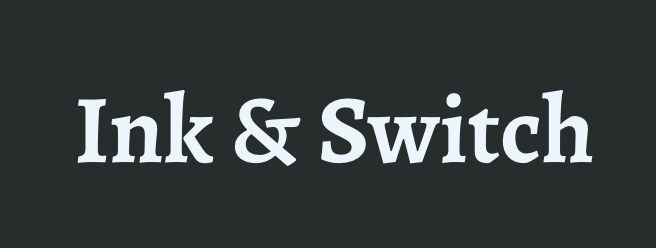
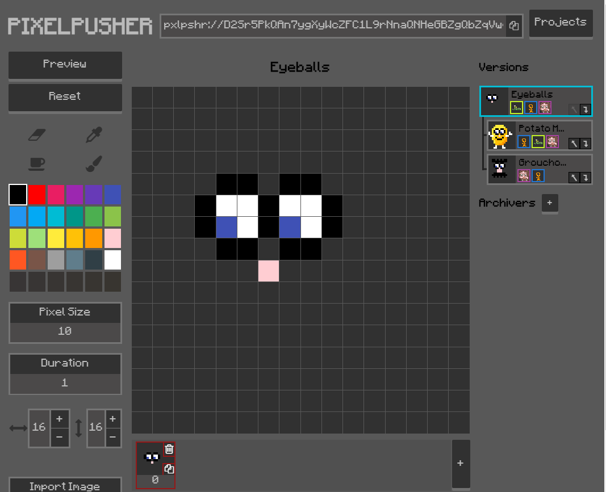
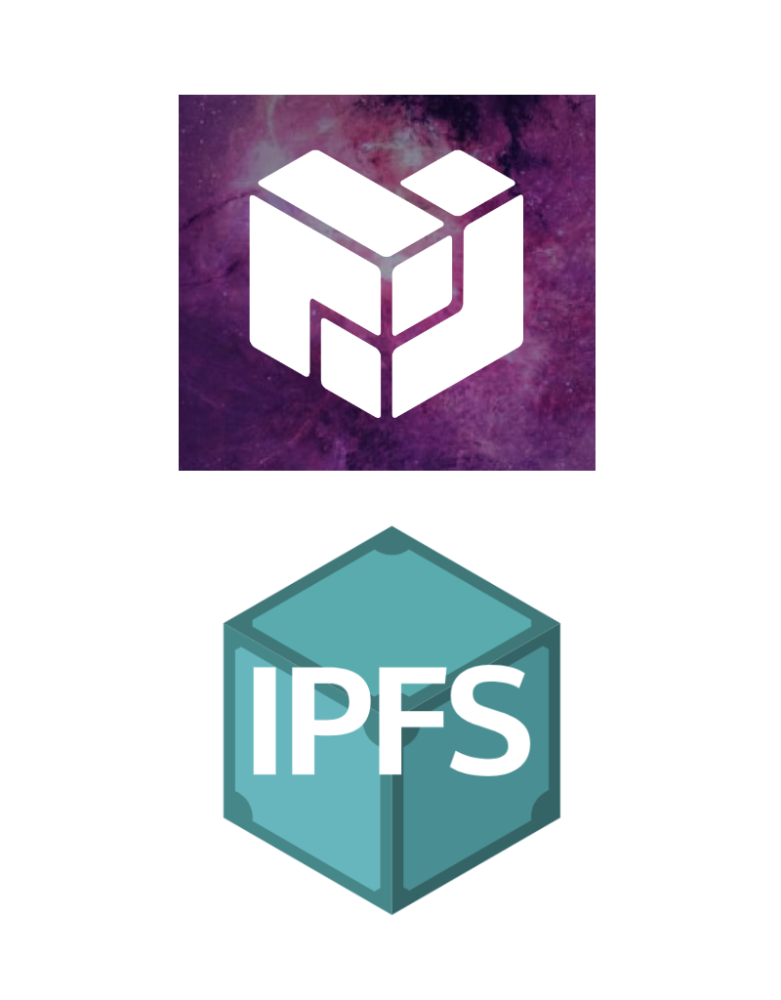

export { default as theme } from './theme'
import { Split, SplitRight } from 'mdx-deck/layouts'
import { Image } from 'mdx-deck'

# Dat Multiwriter API + CLI
---
# Jim Pick

Vancouver, Canada
---
# Open Source

Starting in 1990s...

* Debian
* Linux Kernel
* Open Source Java
---
# Career

* Mix of startups and consulting
* California and Canada
* Client work: many websites and apps
* Past startup: Joyent, 2009-2011 (Ryan Dahl, Node.js)
---
# Freelancing

2017-2018

Focus on "decentralized web"
---
# Client Projects

2018
---
export default SplitRight

## Ink & Switch

* San Francisco
* original founders of Heroku
---
export default SplitRight

## Ink & Switch

Martin Kleppman, University of Cambridge

O'Reilly - Designing Data-Intensive Applications

Automerge CRDT
---
export default SplitRight

## Ink & Switch

**PixelPusher**

* pixel art editor
* collaborative
* Dat + Automerge CRDT
---
export default SplitRight

## Dat Project

(with @mafintosh)

* Demo: Dat Shopping List
* "multiwriter" command line
---
export default SplitRight

# Protocol Labs

 * IPFS
 * "Dynamic Data"
 * peerpad.net
 * Delta CRDTs
---
# Dat

# Hyperdrive

# Hypercore

---
# Dat Shopping List

[Blog Post](https://blog.datproject.org/2018/05/14/dat-shopping-list/)
---
# Dat Shopping List 東京

## Demo Time!

[Glitch](https://dat-shopping-list-tokyo.glitch.me/)
---
# dat-next

Dat Multiwriter support for the Dat CLI

npm: [@jimpick/dat-next](https://www.npmjs.com/package/@jimpick/dat-next)
---
# ありがとう！！